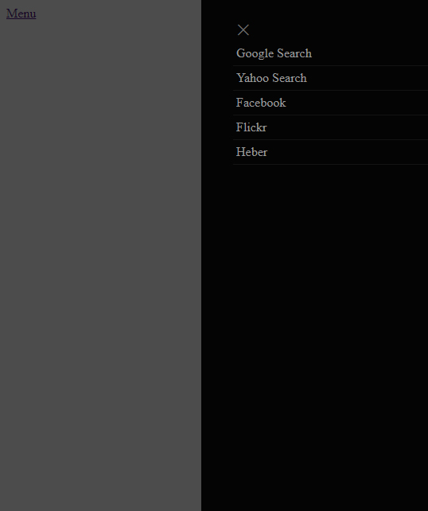

# vue-menu-overlay
A simple, menu overlay for VueJS (2.x) 



## Live Demo

[Demo Site](https://jsfiddle.net/sistemaweb/dth8xpwe/)

## Getting Started

### Prerequisites

The plugin is meant to be used with existing Vue 2.x projects. It uses ES6 features so as long as your build process includes a transpiler, you're good to go.

## Github
[GitHub](https://github.com/heberalmeida/vue-menu-overlay)

### Installing

Install with npm:
```
npm install --save menu-overlay
```

import into project:
```
import Vue from 'vue'
import VueMenuOverlay from 'menu-overlay'

Vue.use(VueMenuOverlay)
```

## Example Usage

```html
<template>
  <div>
    <vue-menu-overlay :menus="links" menuText="Menu"></vue-menu-overlay>
  </div>
</template>

<script>
  import Vue from 'vue'
  import VueMenuOverlay from '../src/index'
  Vue.use(VueMenuOverlay)
  export default {
    data(){
      return {
          links: [
              { title: 'Google Search', url: 'http://www.google.com', target: '_black'},
              { title: 'Yahoo Search', url: 'http://www.yahoo.com', target: '_black'},
              { title: 'Facebook', url: 'http://www.facebook.com', target: '_black'},
              { title: 'Flickr', url: 'http://www.flickr.com', target: '_black'},
              { title: 'Heber', url: 'http://www.heber.com', target: ''},
          ]
      }
    }
  }
</script>
```

## Authors

* **Heber Almeida** - *Initial work* - [heberalmeida](https://github.com/heberalmeida)

## License

This project is licensed under the MIT License

## Acknowledgments

Inspiration, layout taken from
* Saran Chamling [sanwebe](https://www.sanwebe.com/2016/08/creating-simple-slide-bar-menu-quickly)
